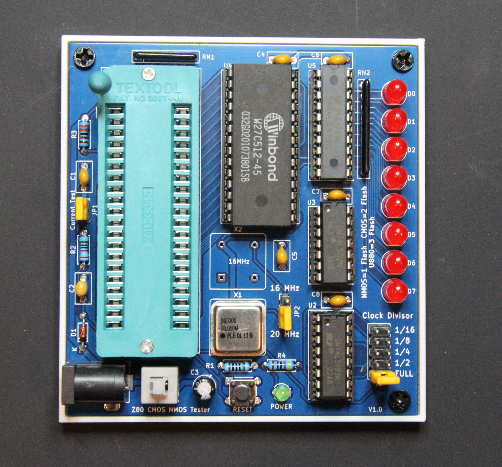

Test your Z80 CPU at multiple frequencies and detemine if your remarked chip from China is a NMOS or CMOS variant. Based  on the work originally by [Виталий Рудик](https://oshwlab.com/vitalian1980/z80-tester) and later respun/improved by [kinzi](https://www.forum64.de/index.php?thread/133402-z80-tester-zum-testen-unbekannter-z80-cpus/).

I respun the PCB again to add a few quality of life improvements I wanted like a barrel power connetor, power switch and  LED, current measuring header, improved reset circuitry, and switched to 1/2 can oscillators instead of using a crystal and associated components (Pierce oscillator).

Unlike a simple NOP tester, this one works by loading a simple program from the EPROM/EEPROM.  It first checks the variant by using undocumented instructions like `OUT (C),0` , flashes the LED array one to three times to indicate the type, and then does a LED chaser display up and down the various data bus lines. Takes up to two 1/2 can oscillators and with the frequency dividers can test at the following frequencies. 

| Divider | 20 MHz Oscillator | 16 MHz Oscillator |
| ------- | ----------------- | ----------------- |
| Full    | 20 MHz            | 16 MHz            |
| 1/2     | 10 MHz            | 8 MHz             |
| 1/4     | 5 MHz             | 4 MHz             |
| 1/8     | 2.5 MHz           | 2 MHz             |
| 1/16    | 1.25 MHz          | 1 MHz             |

### BOM

There is an interactive BOM [here](https://djtersteegc.github.io/z80-cmos-nmos-tester/ibom.html) or [CSV](https://djtersteegc.github.io/z80-cmos-nmos-tester/z80-cmos-nmos-tester-BOM.csv).  I like using Winbond W27C512 EEPROM's in 27C512 applications since they don't require UV to erase like a traditional EPROM.

### Assembly

In the 3D directory there are STL's to print an (optional) LED alignment jig, some support blocks to keep the board level while you solder the LED's, and a simple mounting plate. Secure the PCB to the plate with M3 x 4mm screws.

### Firmware Programming

kinzi's rev3 firmare can be found in the zip file in the **firmware** directory.  Burn **test.z80.u880.rev3.bin** to a 27C512 compatible EPROM/EEPROM.

### Usage

Supply 5V center positive to the 5.5mm x 2.1mm DC power jack. On power up, the Z80 should automatically reset, if not, push the reset button.  The LED array will flash once for NMOS variants, twice for CMOS, or three times for a U880.  After that, the LED's will go "knight rider", and then reset in a continous loop.  Use the two jumpers to select the appropiate osciallator and frequency divider you want to test at.

JP1 (Current Test) feeds 5V to the Z80. Remove the jumper and attached a multimeter in current mode if you would like to test current draw of your Z80, another way to tell NMOS and CMOS variants apart. NMOS is around 200mA, CMOS is between 10 to 100mA depending on clock frequency.

Here's a quick demo of the board in action with both a real and fake 20MHz CMOS version from a batch of ten from AliExpress, https://youtu.be/2GuPsmFTtck

### Getting a PCB Board

Any extras I have available will be in my [Tindie](https://www.tindie.com/products/tersteeg/z80-cmos-nmos-tester-pcb/) store. I don't ship outside the US currently, but gerber files are available if you want to order your own from your favorite PCB fab like JLCPCB or PCBWay.

